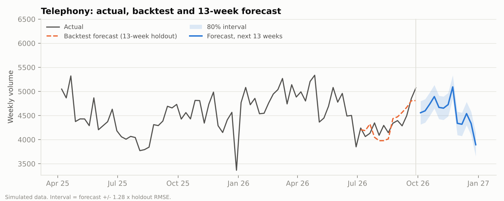
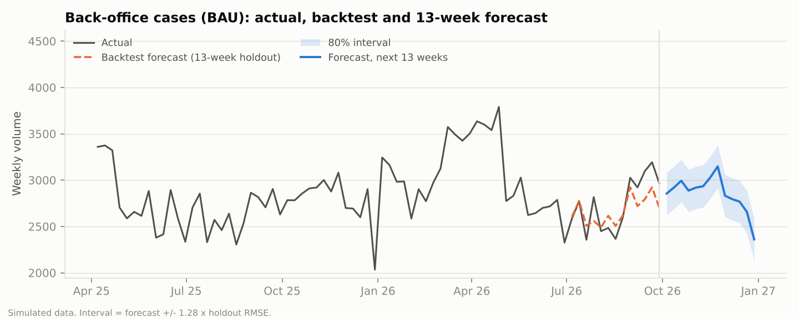
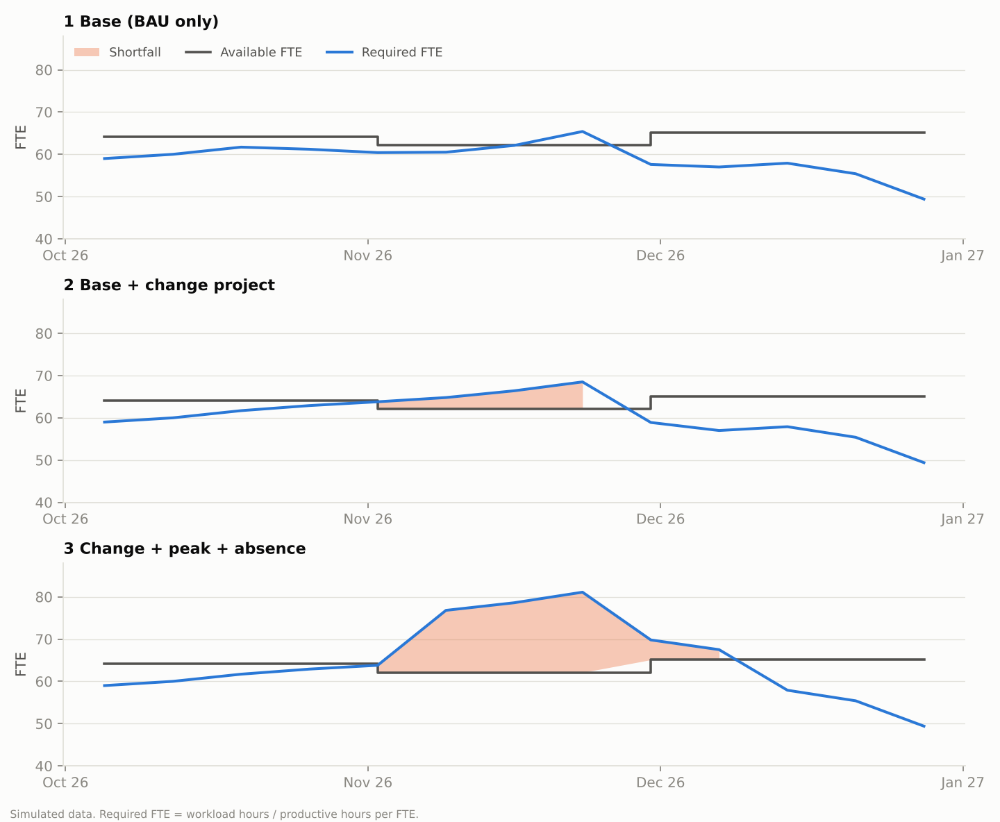
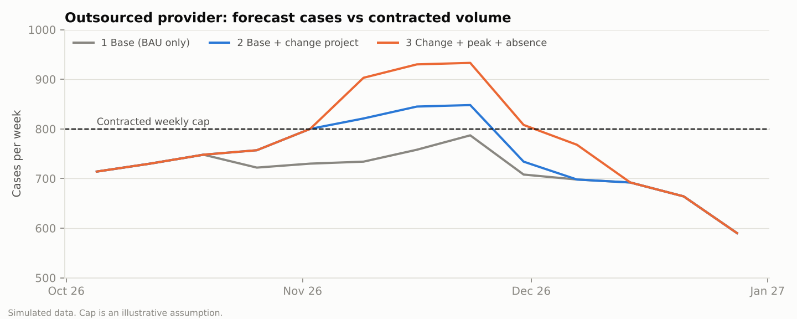

# Service Operations Planning Model

Weekly demand forecasting and workforce capacity planning for a financial services customer operations team. The Python model forecasts calls and back-office cases, converts demand into required FTE, and compares it with available staff across three scenarios. An Excel workbook repeats the capacity logic with live formulas.

## Features

- Weekly forecast of telephony and back-office demand, with an 80% prediction interval
- Backtest against a seasonal naive benchmark, with MAPE and bias
- Demand-to-FTE conversion using handling time, shrinkage and occupancy
- Scenario analysis: base, planned change project, and peak volume with higher absence
- Gap sizing with overtime first, then temporary or recruited FTE
- Outsourced provider volume tracked against its contracted weekly cap

## Results

Forecast accuracy on a 13-week holdout:

| Series | Holt-Winters MAPE | Seasonal naive MAPE | Bias |
|---|---|---|---|
| Calls | 3.8% | 4.7% | -0.5% |
| Back-office cases | 5.2% | 5.5% | -2.5% |





Capacity over the next 13 weeks, starting from 64.1 FTE with two leavers in week 5 and three hires in week 9:

| Scenario | Peak required FTE | Weeks short | Peak gap (FTE) | Temp FTE after overtime | Weeks provider over cap |
|---|---|---|---|---|---|
| 1 Base (BAU only) | 65.4 | 1 | 3.3 | 0 | 0 |
| 2 Base + change project | 68.5 | 4 | 6.3 | 0 | 3 |
| 3 Change + peak + absence | 81.1 | 6 | 19.0 | 7 | 4 |





## How it works

1. **Forecast.** Business-as-usual demand is forecast separately from change-project demand. Seasonal naive and Holt-Winters (damped trend, multiplicative seasonality) are compared on the holdout, and the better model is refitted on all history. The interval is the forecast plus or minus 1.28 x holdout RMSE.
2. **Capacity.** Workload hours = calls x handling time + in-house cases x handling time. Productive hours per FTE = contracted hours x (1 - shrinkage) x occupancy. Required FTE = workload hours / productive hours.
3. **Scenarios.** Scenario 3 is a stress test with 10% more volume and 35% shrinkage in five peak weeks. Shortfalls are covered by overtime first, then temporary or recruited FTE.
4. **Provider.** Forecast provider volume is flagged in any week it exceeds the contracted cap.

Assumptions (handling times, shrinkage, occupancy, provider share and cap, overtime limit, change-project size) are set in the `ASSUMPTIONS` block of `forecast_and_capacity.py` and on the workbook's Assumptions tab.

## Project structure

```
.
├── data/service_ops_demand.csv        Weekly dataset
├── outputs/                           Forecast, capacity plan, accuracy tables, charts
├── generate_data.py                   Creates the dataset
├── forecast_and_capacity.py           Forecast, backtest, capacity and scenarios
├── make_charts.py                     Charts
├── notebook.ipynb                     Step-by-step walkthrough
├── Service_Ops_Planning_Model.xlsx    Live-formula capacity workbook
├── build_workbook.py                  Builds the workbook
├── build_notebook.py                  Builds the notebook
└── requirements.txt
```

## Getting started

```
pip install -r requirements.txt
python generate_data.py
python forecast_and_capacity.py
python make_charts.py
```

The workbook's Forecast tab holds values pasted from the Python output. Everything downstream of them is a live formula.

## Data note

The data is simulated and all assumptions are illustrative, so the results show that the method works, not what accuracy to expect on real data.
